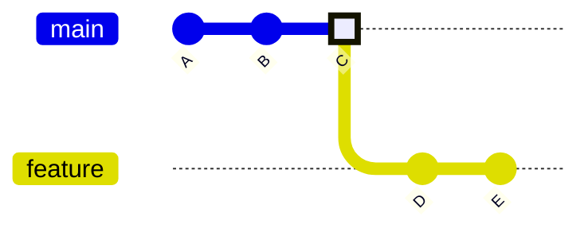
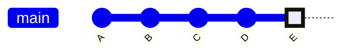
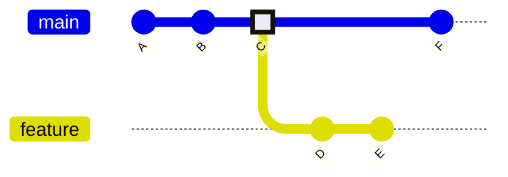
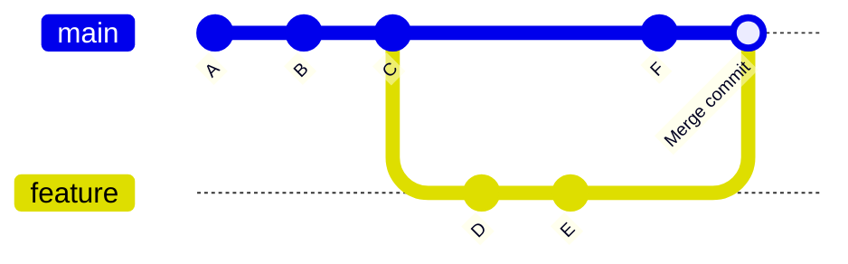
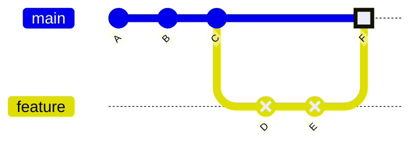
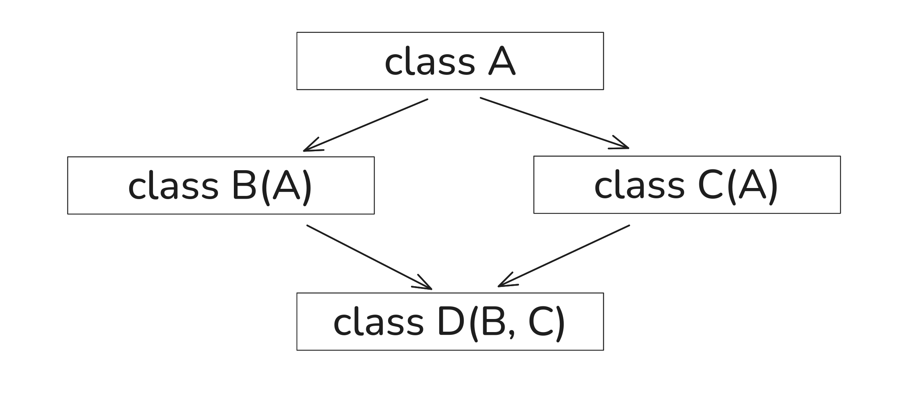
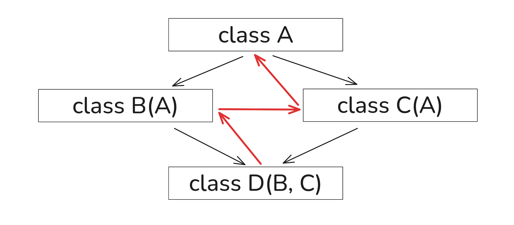

# Добро пожаловать

---
transition: slide-up
---

### Git Merge

Основные способы слияния изменений из одной ветки в другую в Git

**Типы merge:**

- **Fast-forward**: когда main не изменялся → прямое перемещение указателя

<div class="flex gap-2">

<div>До merge</div>


<div>После merge</div>

</div>

---

### Git merge

- **Three-way**: когда есть изменения в обеих ветках → создается новый commit для слияния изменений

<div class="flex gap-2">

<div>До merge</div>


<div>После merge</div>

</div>

- **Squash**: все коммиты ветки, которая объединяется в основную ветку, объединяются в один коммит

<div class="flex gap-2">

<div>До merge</div>


<div>После merge</div>

</div>

---

### Git Merge

```bash
# Создание feature ветки
git checkout -b other_branch
git add .
git commit -m "Add user authentication"
git push origin other_branch

# Merge в main
git checkout main
git merge other_branch

# если надо чтобы строго не использовался способ fast-forward
# а создавался коммит слияния
git merge --no-ff other_branch
```

---

### Pull Request (GitHub) / Merge Request (GitLab)

Это способ интеграции изменений из одной ветки в другую на GitHub/GitLab

- Code review процесс
- Обсуждение изменений
- Автоматические проверки (CI/CD)
- Защита основных веток

---

### Git merge - конфликты

Когда в разных ветках есть изменения в одном и том же файле, Git не может самостоятельно решить, какие изменения принять и создает конфликт

---
transition: slide-up
layout: two-cols
---

### Множественное наследование в Python

Python поддерживает множественное наследование, но это может привести к **Diamond Problem**
, то есть проблема порядка вызова методов из родительских классов

<v-click hide>



</v-click>
<v-click hide>



</v-click>

<v-click>

#### MRO (Method Resolution Order)

Python использует **C3 linearization** для определения порядка вызова методов

</v-click>

::right::


```python
class A:
    def method(self):
        print("A.method")

class B(A):
    def method(self):
        print("B.method")
        super().method()  # Вызывает следующий в MRO

class C(A):
    def method(self):
        print("C.method")
        super().method()

class D(B, C):  # MRO: D -> B -> C -> A
    def method(self):
        print("D.method")
        super().method()

# Использование
d = D()
d.method()  # Выведет: D.method, B.method, C.method, A.method
print(D.__mro__)  # Показывает порядок разрешения методов
```

---

### Mixins

Классы, которые не имеют своих свойств и методов, но могут использоваться для расширения других классов

Best practices:
To avoid common pitfalls, follow these guidelines when working with mixins:

- Prioritize mixins: Always list mixins to the left of the main base class in the inheritance list to ensure their methods are called first by the MRO.
- Use super(): Call super().method() from within a mixin's method to ensure the next method in the MRO is executed. This enables cooperative multiple inheritance, allowing the mixin to enhance rather than replace the base class's behavior.
- Keep mixins stateless: Mixins should typically contain only behavior (methods) and rely on the host class for state (instance variables). This prevents naming conflicts and makes your code more modular and predictable.
- Name mixins clearly: A common convention is to append Mixin to the class name (e.g., LoggingMixin) to explicitly indicate its purpose and prevent it from being instantiated directly. 


---
transition: slide-up
---

### Методы класса: classmethod, staticmethod

Различные типы методов и переменных класса

```python
class User:
    # Переменная класса - общая для всех экземпляров
    total_users = 0
    default_role = "user"

    def __init__(self, name, email):
        self.name = name
        self.email = email
        User.total_users += 1  # Обращение к переменной класса

    @classmethod
    def get_total_users(cls):
        """Метод класса - имеет доступ к cls (классу)"""
        return cls.total_users

    @classmethod
    def create_admin(cls, name, email):
        """Альтернативный конструктор"""
        admin = cls(name, email)
        admin.role = "admin"
        return admin

    @staticmethod
    def validate_email(email):
        """Статический метод - не имеет доступа к self или cls"""
        return "@" in email and "." in email

    def __str__(self):
        return f"{self.name} ({self.email})"

# Использование
user1 = User("Alice", "alice@example.com")
user2 = User("Bob", "bob@example.com")
admin = User.create_admin("Charlie", "charlie@example.com")

print(User.get_total_users())  # 3
print(User.validate_email("test@mail.com"))  # True
print(User.default_role)  # "user"
```

---
transition: slide-up
---

### Декораторы в Python

Декораторы - это функции, которые модифицируют поведение других функций

#### Что такое декораторы?

- Паттерн проектирования **Decorator**
- Функции высшего порядка
- Синтаксический сахар с `@`

#### Применение декораторов

- Логирование и мониторинг
- Кэширование результатов
- Проверка прав доступа
- Измерение времени выполнения
- Валидация входных данных

```python
import time
import functools

def timer(func):
    """Декоратор для измерения времени выполнения"""
    @functools.wraps(func)
    def wrapper(*args, **kwargs):
        start = time.time()
        result = func(*args, **kwargs)
        end = time.time()
        print(f"{func.__name__} выполнилась за {end - start:.4f} секунд")
        return result
    return wrapper

def cache(func):
    """Простой декоратор кэширования"""
    cache_dict = {}

    @functools.wraps(func)
    def wrapper(*args):
        if args in cache_dict:
            print(f"Кэш попадание для {args}")
            return cache_dict[args]
        result = func(*args)
        cache_dict[args] = result
        return result
    return wrapper

@timer
@cache
def fibonacci(n):
    if n < 2:
        return n
    return fibonacci(n-1) + fibonacci(n-2)

# Использование
print(fibonacci(10))  # Первый вызов - медленно
print(fibonacci(10))  # Второй вызов - из кэша
```

---
transition: slide-up
---

### Декораторы с параметрами

Декораторы, которые принимают аргументы для настройки поведения

```python
import functools
import time

def retry(max_attempts=3, delay=1):
    """Декоратор с параметрами для повторных попыток"""
    def decorator(func):
        @functools.wraps(func)
        def wrapper(*args, **kwargs):
            last_exception = None

            for attempt in range(max_attempts):
                try:
                    return func(*args, **kwargs)
                except Exception as e:
                    last_exception = e
                    print(f"Попытка {attempt + 1} неудачна: {e}")
                    if attempt < max_attempts - 1:
                        time.sleep(delay)

            print(f"Все {max_attempts} попыток исчерпаны")
            raise last_exception
        return wrapper
    return decorator

def validate_types(**expected_types):
    """Декоратор для валидации типов аргументов"""
    def decorator(func):
        @functools.wraps(func)
        def wrapper(*args, **kwargs):
            # Получаем имена параметров функции
            import inspect
            sig = inspect.signature(func)
            bound_args = sig.bind(*args, **kwargs)
            bound_args.apply_defaults()

            # Проверяем типы
            for param_name, expected_type in expected_types.items():
                if param_name in bound_args.arguments:
                    value = bound_args.arguments[param_name]
                    if not isinstance(value, expected_type):
                        raise TypeError(
                            f"{param_name} должен быть {expected_type.__name__}, "
                            f"получен {type(value).__name__}"
                        )

            return func(*args, **kwargs)
        return wrapper
    return decorator

# Использование декораторов с параметрами
@retry(max_attempts=5, delay=0.5)
def unstable_network_call():
    import random
    if random.random() < 0.7:  # 70% вероятность ошибки
        raise ConnectionError("Сеть недоступна")
    return "Данные получены успешно"

@validate_types(name=str, age=int, salary=float)
def create_employee(name, age, salary=0.0):
    return f"Сотрудник: {name}, возраст: {age}, зарплата: {salary}"

# Примеры использования
try:
    result = unstable_network_call()
    print(result)
except ConnectionError:
    print("Не удалось получить данные")

employee = create_employee("Анна", 30, 75000.0)
print(employee)

# Это вызовет ошибку типа:
# create_employee("Иван", "тридцать")  # TypeError
```
